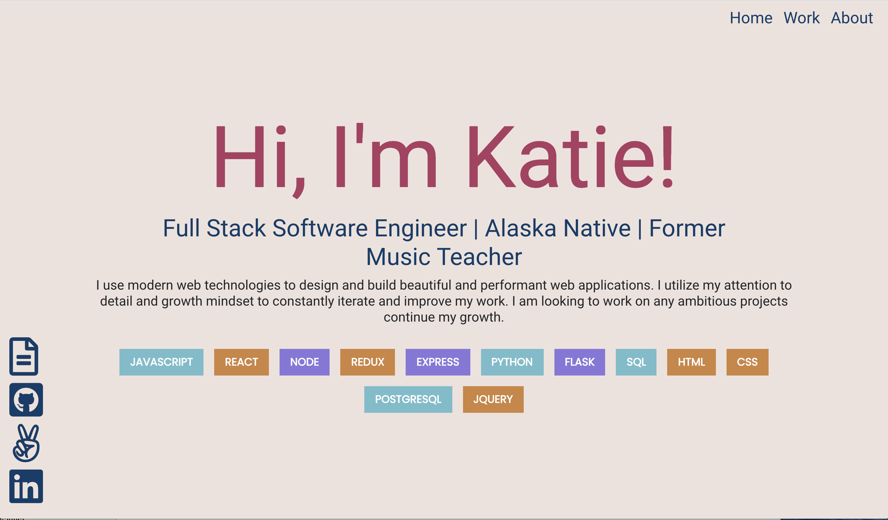
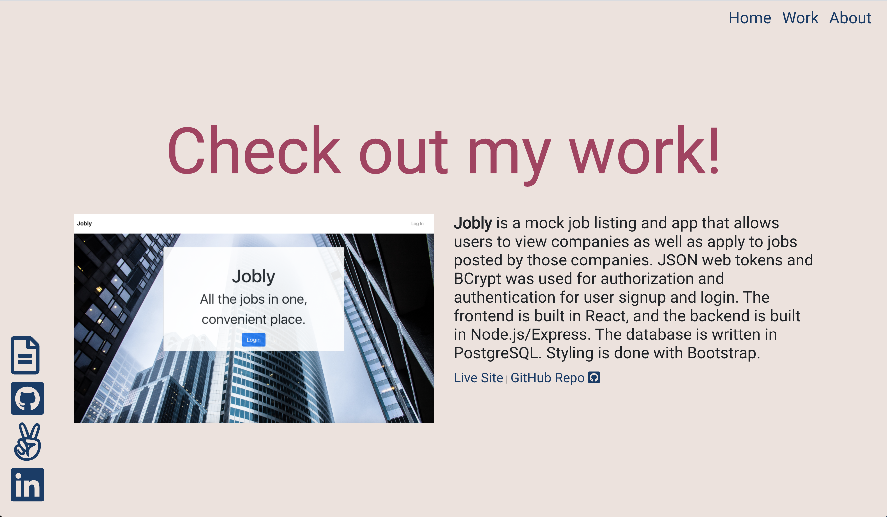
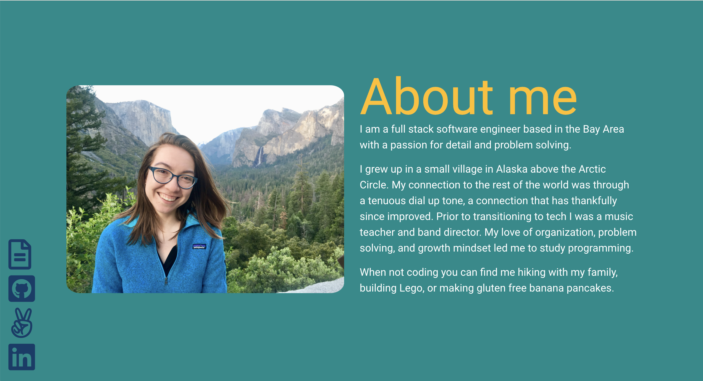
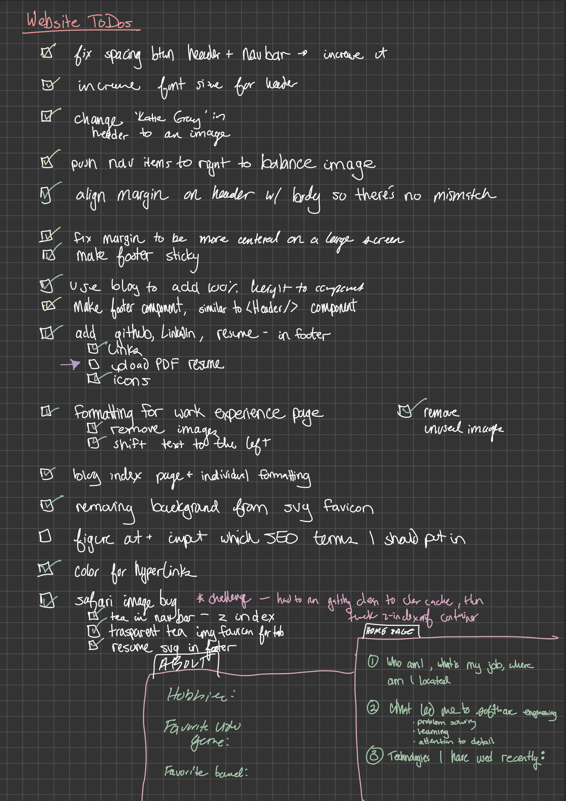

## Introduction

The new year 2022 rolled around, and an email arrived in my inbox with a title along the lines of “Your Google domain expires in 30 days!” As I navigated to said domain, <a style="color: #2979D9" href="https://katiegray.us">katiegray.us</a> (Note: this domain expires end of February 2022, but you can see <a style="color: #2979D9" href="https://github.com/KatieJessupMcd/personal-website">the Github repo here</a>), I reflected that my corner of the internet was in need of a redesign. Well, my exact thought as I looked at my current website at the time was more along the lines of “EW GROSS”. The information was outdated and the design looked stale, so I took this as a great opportunity to go back and improve my previous work and pick up some new skills along the way.

Last spring I was struck by similar inspiration, but life happens, and after much ado I was able to get my new website deployed after a few nights of hacking in January. Before jumping into the process of building and deploying my new website, <a style="color: #2979D9" href="https://github.com/KatieJessupMcd/kgray-personal-website">here is the Github repo for this project</a>.

## Process

So as not to overwhelm myself and get stuck in the “agh I don’t like any of it, where do I even start” phase, I broke down my process to re-design, re-code, and re-deploy my website into the general following steps:

1. Reflection
   - Take inventory of the current site by making a list of Plusses (things doing well) and Deltas (things to improve)
2. Set Goals
   - Break down & prioritize the things I would like to improve
3. Tech Stack Selection
   - Choose the tool for the job, and the reasoning
4. Design Considerations
5. Implementation
   - Write the code (easy part)
   - Write the copy (hard part)
6. Deployment
7. Things I made note of along the way
   - Any challenges
   - Next steps & wishlist for future features

This kept me focused on the problems to solve at each step of the process.

## Reflection

First, I took a basic inventory of my website, reflecting on things I thought I did well on the website, as well as things I would like to improve on in the next iteration.

For reference, here are a couple screenshots from my old website:

This was the Plusses/Deltas T-chart I wrote out to help inform and distill which problems I wanted to focus on solving.

<table>
  <tr>
   <td>Plusses (This Doing Well)
   </td>
   <td>Deltas (Things to Improve)
   </td>
  </tr>
  <tr>
   <td>
<ul>

<li>it loads (good start, good start)

<li>has an SSL certificate (provided by AWS, I remember stubbornly working through the <a href="https://docs.aws.amazon.com/acm/" style="color: #2979D9">AWS documentation</a> to figure that out)

<li>hosted at a domain that makes sense

<li>links on the side still open, although it's a bummer that the links don't open in a new tab

<li>font is readable, not too busy

<li>links to projects still work

<li>mobile responsiveness is ok (a tiny bit of overlap on the left hand sticky, but not too bad)

<li>general responsiveness is ok

<li>React components make sense
</li>
</ul>
   </td>
   <td>
<ul>

<li>it feels a little clunky and discombobulated

<li>does not include latest work experience

<li>no space for me to add more interesting content of what I'm learning about, ie a blog

<li>why are there so many languages listed on the landing page? it's not that interesting to read, and also why is that first sentence so formal?

<li>while clicking top navigation to get to the lower section of the page makes sense, it doesn’t quite bring you to the clean header.

<li>regarding the tech stack itself, it is a single page React application, hosted on Heroku, with SLL certificate handled with AWS  - it is a bit of a process to update

<li>arriving at the landing page, there is a lot of text to read.

<li>and the colors are blah. I would almost prefer more simplicity

<li>projects are old and feel outdated

<li>while the links to the live projects work, they are hosted on the free tier of Heroku and take forever and a year to get the server spun up and loaded

<li>one of the project databases is broken

<li>spacing feels a little off, a lot of no-person's-land between each section

<li>linked resume is outdated

<li>it doesn't feel very compelling to read through, not a great first impression
</li>
</ul>
   </td>
  </tr>
</table>

## Goals

As I took a look at the Plusses and Deltas, I organized them into three main buckets:

### Tech stack

- regarding the tech stack itself, it is a single page React application, hosted on Heroku, with SLL certificate handled with AWS - it is a bit of a process to update
- while the links to the live projects work, they are hosted on the free tier of Heroku and take forever an a year to get the server spun up and loaded
- one of the project databases is broken

### Content

- does not include latest work experience
- no space for me to add more interesting content of what I'm learning about, ie a blog
- why are there so many languages listed on the landing page? it's not that interesting to read, and also why is that first sentence so formal?
- projects are old and feel outdated
- linked resume is outdated
- it doesn't feel very compelling to read through, not a great first impression

### Design

- it feels a little clunky and discombobulated
- while clicking top navigation to get to lower section of the page makes sense, it doesn’t quite bring you to the clean header.
- arriving at the landing page, there is a lot of text to read.
- and the colors are blah. I would almost prefer more simplicity
- spacing feels a little off, a lot of no-person's-land between each section

Based on this subcategories, I set these as my **goals** for my updated website:

- New(ish) tech stack (want to keep React) that gives me the ability to expand content, such as blogs
- Refresh the content and copy, and write blogs to populate
- Simple clean UI

## Tech Stack

My <a style="color: #2979D9" href="https://github.com/KatieJessupMcd/personal-website">previous website</a> was a Single Page Application (SPA) written with React, with the build file hosted on the free tier of <a style="color: #2979D9" href="https://www.heroku.com/">Heroku</a>. I provided and configured the SSL certification through AWS. Although the process was several years ago, I recall having less hair at the end of the process due to frustrations of deployments and manual SSL certificate configuration. Additionally, while I could potentially add pages and content for a blog myself in the application, I wanted to find a tool that would enable me to build out a rich blog experience without me having to build it from scratch.

<a style="color: #2979D9" href="https://www.gatsbyjs.com/">Gatsby</a> fit my needs to meet the goals for my website, for the following reasons:

- Gatsby uses React, which I already knew
- Allowed me to have a quick way to implement blog content on my own website by leveraging Gatsby’s ability to handle routing, templating, and frontmatter. Also being able to write blogs in markdown, pushing them to my main branch, and having them converted and ready go to automatically was a plus
- Although a <a style="color: #2979D9" href="https://www.gatsbyjs.com/starters/gatsbyjs/gatsby-starter-default">gatsby-starter-default</a> template was available (among many others), it is barebones enough to code up my own customized website experience.
- Increase website speed by taking advantage of Gatsby’s static rendering
- A chance to familiarize myself with <a style="color: #2979D9" href="https://graphql.org/">GraphQL</a>, the query language that Gatsby uses
- The main purpose of my website at the current moment was more static content (ie blogs, landing page), which fits nicely into the Gatsby environment
- There were also all sorts of plugins I can use to further enhance my website down the road (ie Google Analytics, embedding Youtube videos etc.)

When it came to deploying the site, I chose to use <a style="color: #2979D9" href="https://www.netlify.com/">Netlify</a>. I’ve used Netlify at work, and I could see in the <a style="color: #2979D9" href="https://www.gatsbyjs.com/docs/how-to/previews-deploys-hosting/deploying-to-netlify/">documentation</a> that Gatsby has an integration with the service. It was a lot more simple to implement an SSL certificate through Netlify as well. Additionally, by configuring my Github repo with Netlify, I could push changes out much faster than my old website setup. With Netlify, I could simply push to the main branch on my Github repo, and a new version of my website was deployed.

## Design

My design goal for the new website was to have a design that was more simple than my last website. Even though I wanted a simple design, I still wanted to ensure that it was clean and responsive, so I paid special attention to ensure the site was mobile responsive. I went with a palette of black, gray and white, with the only color being link colors for now. However, I still tried to come up with something that wasn’t too boring, so I utilized my CSS Grid skills to create a slightly asymmetrical header. The Gatbsy starter template I used didn’t offer much in the way of formatting, and I had to find <a style="color: #2979D9" href="https://dev.to/hzburki/100-height-to-all-divs-gatsby-33nd">a workaround</a> to allow it to fill 100% of the height. Most of my design process took place on notebook sketches, with basic sitemaps outlines for the Home, About, Work, and Blog pages.

## Implementation

In terms of implementing my plan, and actually coding out the site and creating the content, I found that creating and writing the copy to be the more difficult part. Writing the code itself was the easy part. I found <a style="color: #2979D9" href="https://www.youtube.com/watch?v=6YhqQ2ZW1sc">this Youtube tutorial</a> useful in familiarizing myself with Gatsby and getting started. By leveraging my React skills, I was able to quickly further build out the site the way I wanted it to look and function.

## Deployment

Deployment was straightforward with Netlify. In fact, I even bought my new domain through them and had them handle the SSL certificate configuration this time around. Overall it was a really frictionless process.

## Challenges

The following are some challenges I encountered as I worked to get my website out:

- I kept moving the goalposts for myself. It was often a cycle of, “Yes, I will be able to release once I fix this one thing - [fixes one thing] - Oh wait, I’ve spotted this tiny thing, I can release once I fix THIS one thing … [rinse and repeat]".
  The way I combat and break out of my brain’s cycle is adhering to a checklist:
   
  

- Writing the copy is hard, so I utilized a technique a past intern on my team at work taught me - writing drafts in the font Comic Sans frees up the pressure of perfection in what should be a draft
- Some of the Gatsby plugins mentioned in the tutorial I used was outdated, but this was an easy fix with some digging and debugging
- Originally, I tried this more <a style="color: #2979D9" href="https://github.com/vagr9k/gatsby-advanced-starter/">advanced template</a>, but found that it had too many features for my needs. I’m ok with starting with an MVP (minimal viable product) and then upgrading later as necessary
- Design first? Code first? I found myself trying to write out code before I actually had a set design in mind. I realized I had taken for granted at work being handed a Figma file from a designer, and then writing the code to meet the exact specifications. That coding to specification part I excel at, the ‘coming up with a nice looking layout from scratch’, not so much. This is part of the reason I decided to go with a more simple design, because if there’s anything I’ve learned from <a style="color: #2979D9" href="https://www.netflix.com/title/80179138">my favorite baking show ‘Nailed It’</a>, you gotta let the cookie cool down before adding any extra icing, or its’ gonna be a hot mess (ie lay a solid foundation before getting too wild with the design)

## Next Steps/Wishlist

As I worked to get this new website deployed, there were many ideas that popped into my mind, that, while they were nice ideas, were not ideas that were necessary to meet the bare minimum requirements of my goals. However, I tried to make note as I went to at least get those ideas down for the roadmap.

- Add in gifs in markdown
- SEO - learn how to leverage
- Add in code blocks to markdown
- Metadata and frontmatter
- Hamburger mobile nav bar
- Continue to iterate on the design (ie basic animations/colors etc)
- Adding some more design to the blog index page (ie cards, adding description etc)
- Fix some Markdown shenanigans (formatting, link opening behavior, asset managment etc)
- … and more

## Conclusion

To recap, here are the goals I set out to meet with this iteration:

- New(ish) tech stack that gives me the ability to expand content, such as blogs
- Refresh the content and copy, and write blogs to populate
- Simple clean UI

I am satisfied that this iteration of my website meets these goals. It is certainly far and away better than my _very_ <a style="color: #2979D9" href="https://katiejessupmcd.github.io/index.html">first personal website</a> (although I still have a soft spot for this <a style="color: #2979D9" href="https://katiejessupmcd.github.io/matching_game/">early toy project of mine</a>.

I look forward to continuing to improve my corner of the internet, as well as the feedback Katie three years in the future will have for present Katie.

Cheers!
